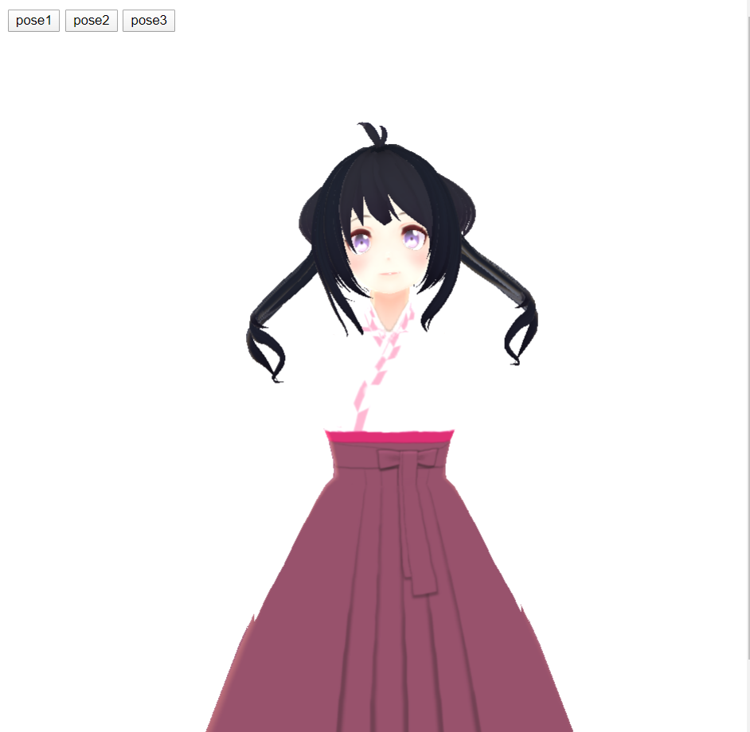
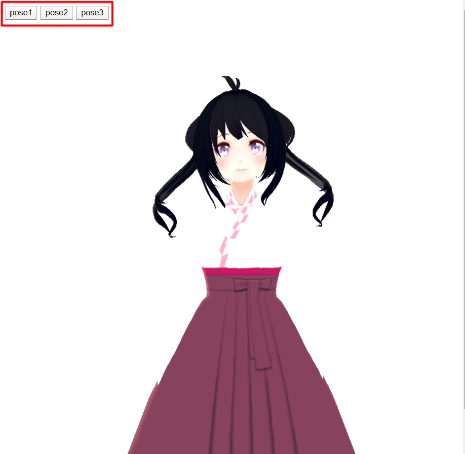
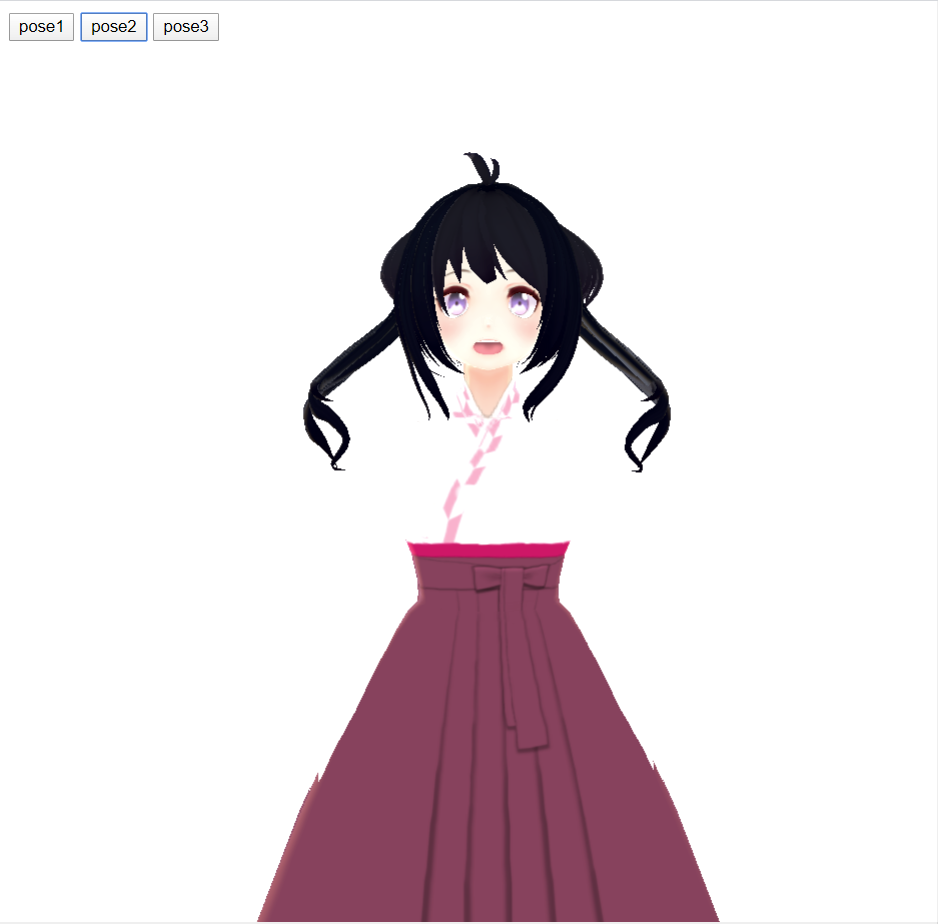
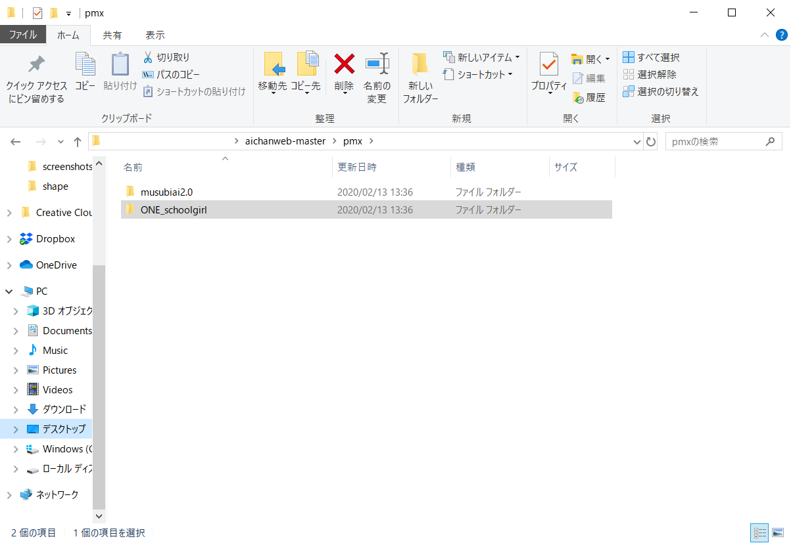
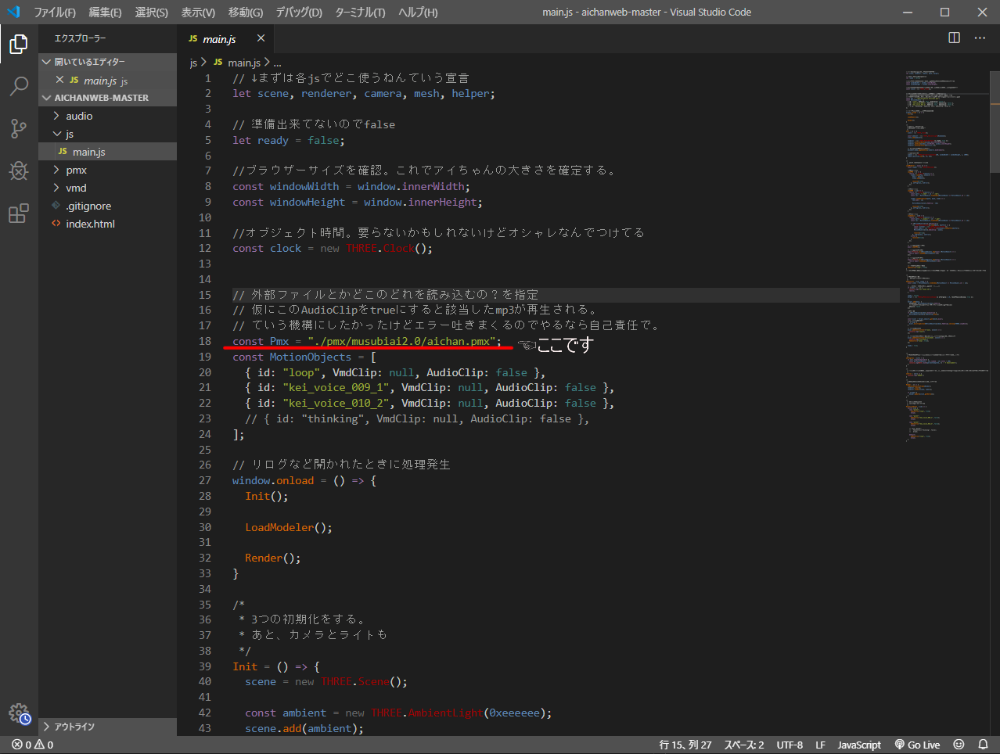
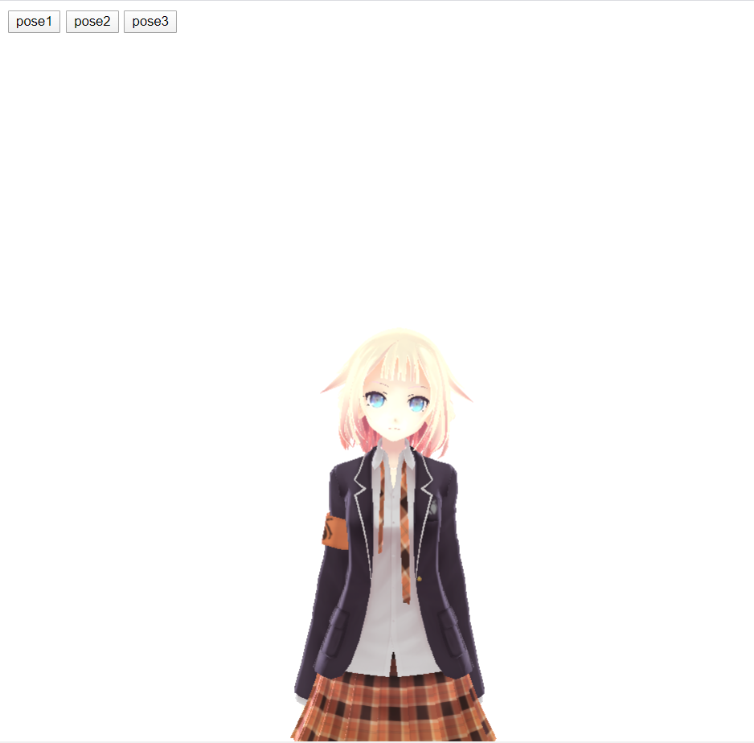
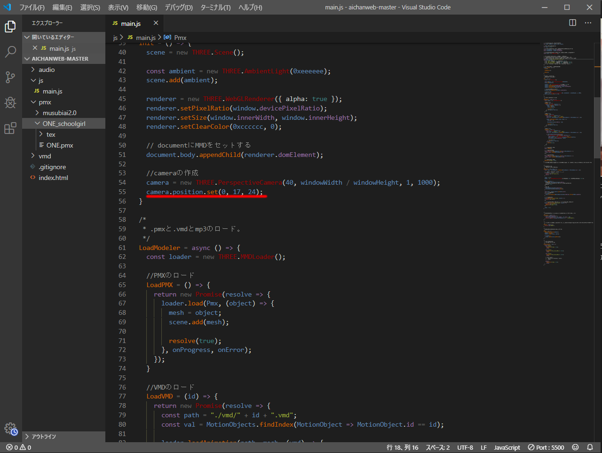
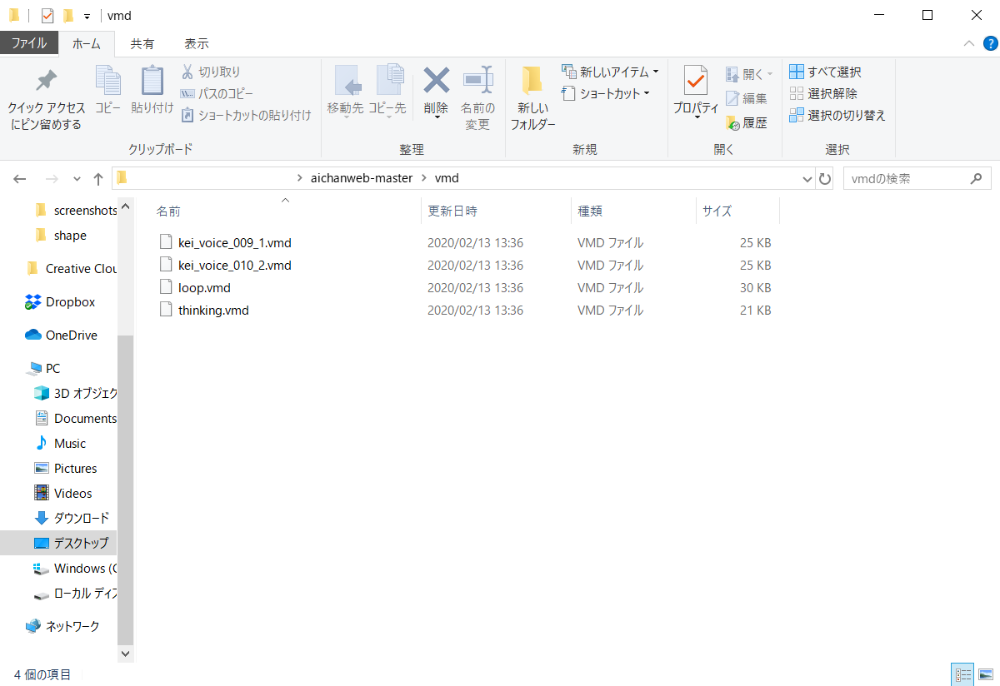

<!-- Markdown: Open Preview to the side -->
# aichanweb
## ファイルの中身確認
中に入っているのは以下の通りです。
```
file
  ┗ musubiai2.0
       ┗ PmxView
            ┗ aichan.x (小道具類のファイル)
       ┗ tex (テクスチャファイル)
       ┗ aichan.pmx (ボーンを少しいじった)
       ┗ musubiai.fx (エフェクトとか。)
       ┗ musubiai2.0.pmx (変換してそのまんま)
  ┗ js(スクリプト)
         ┗ main.js 
  ┗ audio(音声 ボイスとかを色々)
         ┗ kei2_voice_009.mp3 
         ┗ kei2_voice_010.mp3
  ┗ vmd(モーション ボイスに絡めたのを色々)
         ┗ kei_voice_009_1.vmd
         ┗ kei_voice_010_2.vmd
         ┗ loop.vmd
         ┗ thinking.vmd
  ┗ index.html(表示 各種JS読み込み)
```
***
## 取り扱い説明
### 1.ネットに繋がってないと見れません。
理由はindex.htmlを見てください。
### 2.派手に動くモーションは無理です。
カメラ位置を固定にしちゃってます。  
なので画角の外から派手に暴れて写ってくるのしか見えません。
### 3.ロリ系モデルを使う場合はカメラをいじること
まず見切れます。なぜならチビだから。   
アイちゃんの身長に合わせたカメラの位置にしてます。  
なのでチビを使うのであればそれに合わせた位置にいじってください  
「どこのどれや！怒」ていう人は下にスクロールしてください。
### 4.もっと早くモデルを表示したい！
vmdに関してはこれで**最速**のはずです。  
ただ、tgaのほうは試してないのでわかりません。  
もっと早くするならtexの中のpng達を軽くするしかないと思いますが、  
やっても0.014秒変わるという誤差の範囲なのでしてません。
***
## 遊び方
### 1.開く前にまずはブラウザ自体のサイズを任意で決めよう
最大でもいいですし、めっちゃ小さくてもいいです。  
とりあえず開いてるブラウザ自体の表示の大きさを好きな大きさにしてください。
### 2.index.htmlを開いてみよう！
ダウンロードしたindex.htmlでもいいですし、[ここから](https://mhiroki-1214.github.io/aichanweb/)でもいいです。  
開いたら次の画像のような画面が表示されると思います。  

ひとまずモデルが出てきて、首を傾げたりしていたらおkです。
### 3.ポーズを変えてみよう
デフォルトで入ってるものは口パクと首を傾げたりすることしかできないですが、  
それでも動くんやで！っていうのを出してみます。  
次の画像左上に赤色で囲った部分を押してみてください。  
(1:初期状態 2:口パク 3:口パク+首傾げ)

pose2を押してみます。すると・・・

口パクを行いました。  
jsをいじると音声が流れます。  
が、機構が上手くいかないので非推奨です。


以上です。  
これだけ？と思うかもしれませんが、  
ここからjsをいじると色々で来ますので解説します。
***
## main.jsをいじって自分好みに仕上げていこう
自分好みとはいっても、モデルはあのモデルがいいな～・・・と思うかもしれません。  
では、好きなモデルに変えてみよう！ということをします。
### モデルの準備 
まずは、好きなモデルを1つどこかから持ってきてください。  
例えば、ここではONEのモデルを使ってみます。  
ダウンロードができたら画像の用に置いてください。

※仮に、texファイルとpmxがバラバラの場合は1つファイルを作成してその中に入れてください。  
モデルの準備はこれで大丈夫です。
### jsを書き換えてみよう
まずはエディタでmain.jsを開いてみてください。  
開いたら1行目が見える辺りまで上げて置いてください。  
次に、赤い線の部分を書き換えます

現状は・・・
```
const Pmx = "./pmx/musubiai2.0/aichan.pmx";
```
となっているはずです。  
ここを用意したモデルの.pmxとなっている物に書き換えるだけです。
```
//私の場合は・・・
const Pmx = "./pmx/musubiai2.0/aichan.pmx";
             ↓
const Pmx = "./pmx/ONE_schoolgirl/ONE.pmx";
```
では、これで実行してみましょう。すると・・・

若干カメラ位置が気になりますが、無事に表示されました！  
ただ、ループのvmdが少し気になったりしますがそれはしょうがないとしてください。
### カメラの位置を好きな位置に変えてみよう！
このカメラは置き型だと思ってください。  
モデルを検知してそこに自動で行くという超便利なものではありません。  
モデルここにくるよね？じゃあここに置きまっせというカメラです。無人です。  
カメラをいじっている文はココです。

```
camera.position.set(0,17,24);
```
察しのいい方ならお気づきかと思いますが、  
(x軸,y軸,z軸)という感じで設置しています。  
x軸をいじると左右にズレます。  
y軸をいじると上下にズレます。  
z軸は奥行きが変わります。  
これらをいじってモデルが見やすい位置にカメラを移動させてください。  
これでモデル見えない問題は解決します。
***
## モーションをいじってみませんか？？
あまりやってはほしくないですが、やり方だけ説明します。  
モーションはVMDというファイル形式になっています。  
そちらを確認して、あまり**派手に動かないモーション**を入れてください。  
暴れると終わりです。全部ぐちゃぐちゃになっちゃいます。  
入れる場所はvmdフォルダーです。また、.vmdのみ入れてください。

ここに入れたら次はmain.jsをいじりましょう。  
19行目辺りに次の文が書かれてます。
```
const MotionObjects = [
  { id: "loop", VmdClip: null, AudioClip: false },
  { id: "kei_voice_009_1", VmdClip: null, AudioClip: false },
  { id: "kei_voice_010_2", VmdClip: null, AudioClip: false }
];
```
また、一番下に次の文が書かれてます。
```
PoseClickEvent = (id) => {
  switch (id) {
    case "pose1":
      VmdControl("loop", true);
      break;

    case "pose2":
      VmdControl("kei_voice_009_1", false);
      break;

    case "pose3":
      VmdControl("kei_voice_010_2", false);
      break;

    default:
      VmdControl("loop", true);
      break;
  }
}
```
この共通した部分(loop,kei_voice_009_1,kei_voice_010_2)を書き換えます。  
ここは**同じになるようにしてください**
```
例えば1つ目が
const MotionObjects = [
  { id: "loop", VmdClip: null, AudioClip: false },
となっているのに一番下で
    case "pose1":
      VmdControl("kei_voice_009_1", false);
      break;
となっているとめっちゃおかしくなる
```
こうすることで・・・

ハァイ！！変えれました！！！  
このモーションは最初から入れてあるthinkingというvmdです。  
こんな感じで色々動かせるのでやってみてください。
***
## 最後。
jsとMMDの組み合わせはここ最近安定してきた感じでまさに最先端のjsです。  
これをきっかけに(なるかわからんが)jsのことをもっと学んでみてくださいね。  
また、MMDの利用方法とかも[こちら](https://github.com/mhiroki-1214/mmdaichan)で説明とかしてます。  
色々遊んでみてください！！

***

## そもそもjavascriptってなんなん。
上で紹介した部分しかわかんねえしそもそもjavaってなんやねん。  
となってると思います。少しここで解説をしていきます  
※何やってるかわかる人以外かつ見たい人だけ見てください。
### javascriptの本来の立ち位置
MMDをweb上で動かすにはjsを駆使して描画して動かすしかないです。  
ですが、本来の立ち位置は・・・
```
HTML,CSS,PHPで出来ないことをするプラグイン
```
だと思ってます。  
例えば・・・
```
画像自動切り替えはjs無しで出来た！
でもどのタイミングで変わるか視覚的に見えるようにしたい・・・
```
や
```
スクロールに遅延を加えてオシャレに見せたい。
```
などの要素もふわふわ出てくるとおもいます。  
PHPやCSSでやろうと思えば出来ますが、jsでやると簡単かつ他のサイトなどに流用できます。  
こうしてまとめていくと
```
それ、javascriptでよくね？
```
となります。  
ですがあくまでもプラグインだと思ってください。  
js単体では意味ないです。
## jsを読み込むとき
jsを読み込む(使用する)ときにはまずHTMLのほうでこれ使います！と宣言する必要があります。  
その宣言方法は2つあります
```
↓自分で作成した場合。ディレクトリ指定
<script src="./js/main.js"></script>
↓外部サイトから持ってくる場合。URL指定
<script src="https://cdn.jsdelivr.net/gh/mrdoob/three.js@r106/build/three.js"></script>
```
主に使うのは自分で作成をした場合だと思います。  
外部サイトから持ってくるのはすでにネット上で処理方法が公開されている場合です。   
上記のthree.jsのURLを開いてみるとものすごい量のコードが書かれてます。  
そういったものを利用するのも1つ方法だと思って覚えておいてください。
***
## main.jsの中身を軽ーく解説
### 1：宣言
```
let scene, renderer, camera, mesh, helper;
```
ここでは宣言をしています。  
また、宣言方法は3つあります。  
var,let,constの3つです。  
使い分けは以下の通り
```
var : 再宣言、再代入が可能。
　　例 :
　　　var test = '初期値OK';   
　　　test = '再代入OK';
　　　var test = '再宣言OK';

let : 再宣言が禁止、再代入のみ可能。
　　例 :
　　　let test = '初期値OK';   
　　　test = '再代入OK';
　　　let test = '再宣言ムリ';

const : 再宣言、再代入が禁止。
　　例 :
　　　const test = '初期値OK';   
　　　test = '再代入ムリ';
　　　const test = '再宣言ムリ';
```
使い分けは人それぞれですが、個人的には必要、役割に応じて適したものを使ってます。  
では1行目に戻ります。  
ここでは「scene」「renderer」「camera」「mesh」「helper」  
この4つを宣言しています。
### 2：サイズ設定
```
const windowWidth = window.innerWidth;
const windowHeight = window.innerHeight;
```
ここでは開いているブラウザ自体のサイズを調べてます。   
一般的なサイトなどでは最初にWidthサイズを固定して作成などをしていますが、  
aichanweb場合はサイズ指定をしてしまうと、  
**開かれるモデルが見切れる可能性**があります。  
そこでブラウザ自体のサイズに合わせたらいいということで調べてます。  
ここで調べたサイズは次の場所で使ってます。
```
renderer.setSize(window.innerWidth, window.innerHeight);
と
camera = new THREE.PerspectiveCamera(40, windowWidth / windowHeight, 1, 1000);
```
ここで使ってます。  
ここの文はどういう風に書いてるかはthree.jsなどを見てみるとわかります。
### 3 : 再読み込み時に処理を発生させる。
```
window.onload = () => {
  Init();

  LoadModeler();

  Render();
}
```
ここではサイトが再読み込みされるたびに処理を発生させてます。
そこで利用するのはWindowオブジェクトです。   
windowオブジェクトの詳しい解説は[こちら](https://qiita.com/tsukishimaao/items/39d22fd9178546d6cdeb)を見てください。  
では、その中身
```
Init();
```
これなんやねん。となると思います。  
これはその下に書いてある
```
Init = () => {
        ・
        ・
        ・
        ・
}
```
というのを実行するで！という物です。
### 4 : renderer.○○とかのrenderer
```
例：
　renderer.setPixelRatio(window.devicePixelRatio);
　camera.position.set(0, 17, 24);
```
これらのrendererやcameraは一番最初に宣言したクラスの中にあるこの機能にこれ入れるという物です。  
基本的には最初は初期化されています。  
初期化状態だと使えますが、組み合わせていくと数値を変える必要があります。   
なので、再代入が可能なletを使用しています。  
読み込んだ後は色々再代入して使いやすくアレンジしていけるのもjsの面白いところです。  
### 5 : new演算子
```
const loader = new THREE.MMDLoader();
```
1つのオブジェクトに対して2つ以上のプログラムが読み書きしようとすると   
お互いが干渉をしてしまい正しく作動しません。  
```
物１　←　プログラムA
物１　←　プログラムB

エラー発生orめっちゃおかしいことになる
```
ならば、それぞれ別々にコピーを用意して、  
プログラムを導入すれば干渉しないということになります。  
```
物1　→　プログラムA用物1コピー　←　プログラムA
物1　→　プログラムB用物1コピー　← プログラムB

ダイジョーブ！
```
このコピーをすることがインスタンス化と言います。  
このコピーを用意するのがnew演算子です。  
仮に、「変なことになった」時などはnew演算子を使ってみてください  
それでも変ならプログラムがおかしいです。
***
と、ここまで理解出来ていればjsを触っていけます。   
このほかにも色々ありますが、webで公開されているコードを触って、  
色々研究してみてください
